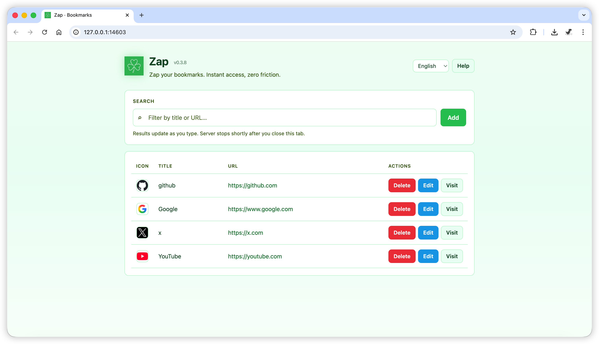

# Zap

[English](README.md) | **中文**

Zap 是一个轻量、高性能的 Alfred Workflow，用来快速管理和打开常用网址。告别反复翻文件夹和标签页，输入、搜索、打开，一步完成。

## 快速开始

先下载安装包并导入 Alfred：下载 release 包后双击安装（或拖入 Alfred 的 Workflows 列表）。

- `zap <title>`：搜索书签。
- `zap edit <title> [url]`：添加或编辑书签。
  - 省略 `url` 时会用 AppleScript 对话框询问 URL。
- `zap del <title>`：删除书签（带确认）。
- `zap web`：在浏览器中打开网页管理界面。

## 截图




## 项目结构

```text
zap/
├── README.md                 # 英文说明（本仓库主 README）
├── README.zh.md              # 本文件 — 中文说明
├── Makefile
├── pyproject.toml            # 版本号、开发依赖、pytest 配置
├── _zap_build_meta.py        # setuptools 占位，便于 `pip install -e ".[dev]"`
├── tests/                    # pytest（见「CI 与合并保护」）
├── .github/workflows/        # GitHub Actions CI
├── promot.md
├── scripts/
│   └── build_workflow.py     # 打包 → dist/
├── workflow/                 # Alfred 工作流源码（在此改脚本与 plist）
│   ├── README.md             # 面向用户的英文说明；构建时写入 info.plist 的 __ZAP_README__
│   ├── info.plist
│   ├── zap.py
│   ├── action.py
│   └── web/                  # 本地 Web UI（server.py + static/）
│       ├── server.py
│       └── static/
└── dist/                     # 由 `make pack` / `make release` 生成（按通道文件名不同）
    ├── zap-test.alfredworkflow # `make pack`（test 通道）
    ├── zap-test-workflow/      # test 解压目录
    ├── zap.alfredworkflow      # `make release` — 对外发布 / GitHub Releases
    └── zap-workflow/           # release 解压目录
```

## 数据存储

- 书签保存在 `~/.config/alfred/zap/`（`zap.json` 与 `icon/`）。

## Alfred 节点说明（供维护者参考）

描述的是打包进工作流里的结构。**最终用户安装时不要按本节操作**；请看上文的「快速开始」。

画布是一条直线：**Script Filter → Run Script → Post Notification**。`http`/`https` 结果在 **`action.py`** 里用 macOS `open`（及 AppleScript 回退）打开。

**工作流变量：** 安装包内默认 **`DATA_PATH`** 为 `~/.config/alfred/zap`，用于指定书签目录；见 [`workflow/info.plist`](workflow/info.plist) 的 `variables`。

1. **Script Filter**（关键字 `zap`）

   - **Language：** `/bin/bash`（plist 里 `type` 为 `0`）。
   - **关键字 + 空格：** `withspace` 开启—Alfred 在用户输入 **`zap` + 空格** 后，把后续内容作为查询传给脚本。`argumenttreatemptyqueryasnil` 开启（空查询按 Alfred 规则处理）。
   - **输入方式：** **argv**（`scriptargtype` 为 `1`），脚本字符串里**不**使用 `{query}` 占位符。
   - **脚本：** `/usr/bin/python3 "$PWD/zap.py" --script-filter "$1"`。
   - **Escaping：** None（`escaping` 为 `0`）。
   - **输出：** `zap.py` 返回的 Alfred JSON。

2. **Run Script**

   - **脚本：** `/usr/bin/python3 "$PWD/action.py" "$1"`（argv）。接收选中项的 `arg`（与 Filter 同为 bash + argv）。
   - **逻辑：** `arg` 为 `http`/`https` URL 时直接打开；为 `web` 时在后台启动 `zap.py web`；否则执行 `zap.py --action …`。

3. **Post Notification**（「Zap notify」）

   - 上一步有非空输出时显示 **`{query}`**（`onlyshowifquerypopulated`），用于展示 `action.py` 的 stdout（例如 “Opened web.”）。

若改坏行为，可重新导入 **`dist/`** 下对应的 `.alfredworkflow`（见下文 **产物**），或对照 [`workflow/info.plist`](workflow/info.plist)。

## 构建打包

### 正式发布版本

对外发布的工作流版本以 [`pyproject.toml`](pyproject.toml) 的 **`[project] version`**（PEP 621）为准，例如 `0.1.0`。发版前修改该字段，再执行 **`make release`**（或 `python3 scripts/build_workflow.py --channel release`）。脚本**不会**改写 `pyproject.toml`；它读取该版本写入安装包，并同步更新 **`workflow/info.plist`**。

发布构建会**忽略** `--version` 与 `ZAP_VERSION`（且 release 下使用 `--version` 会报错）。若 `info.plist` 与 pyproject 不一致会**警告**，但仍采用 pyproject 中的版本。

发版后习惯上给提交打 **`v{x.y.z}`** 标签（如 `v0.1.0`）。可选：维护 `CHANGELOG.md`（Keep a Changelog）。

### 测试 / 日常包（`make pack`）

试装包使用 **`--channel test`**（默认）。脚本读取 [`workflow/info.plist`](workflow/info.plist)，建议 **patch +1**，并交互询问版本：

```text
Version [0.1.1]:
```

回车接受建议，或直接输入 `x.y.z`。构建成功后 **`workflow/info.plist`** 会更新为你选的版本。源 plist 里仅保留占位符 **`__ZAP_README__`**（内容由 [`workflow/README.md`](workflow/README.md) 注入）；description 与 Script Filter 副标题为 plist 内英文原文。

非交互 / CI（仅 test 通道）：

```bash
ZAP_VERSION=0.2.0 python3 scripts/build_workflow.py --channel test
python3 scripts/build_workflow.py --channel test --version 0.2.0
```

若 stdin 不是终端且未设置 `ZAP_VERSION` / `--version`，则自动使用**建议的**递增版本。

### 命令

```bash
make pack     # test 通道
make release  # release 通道，版本来自 pyproject.toml
make install  # 先 pack，再打开 dist/zap-test.alfredworkflow 安装到 Alfred
```

直接调用脚本：

```bash
python3 scripts/build_workflow.py --channel test
python3 scripts/build_workflow.py --channel release
```

**taskipy（可选）：** `task pack`、`task release`、`task pack -- --version 0.2.0`

### 产物

**Test 通道**（`make pack`、脚本默认）：`dist/zap-test.alfredworkflow` 与 `dist/zap-test-workflow/`（解压目录）。

**Release 通道**（`make release`）：`dist/zap.alfredworkflow` 与 `dist/zap-workflow/`（解压目录）。固定文件名供 [`.github/workflows/release.yml`](.github/workflows/release.yml) 上传 Release 使用。

## 命令行调试

```bash
cd workflow
python3 zap.py edit google https://google.com
python3 zap.py "goo"
python3 zap.py del google
python3 zap.py web
```
